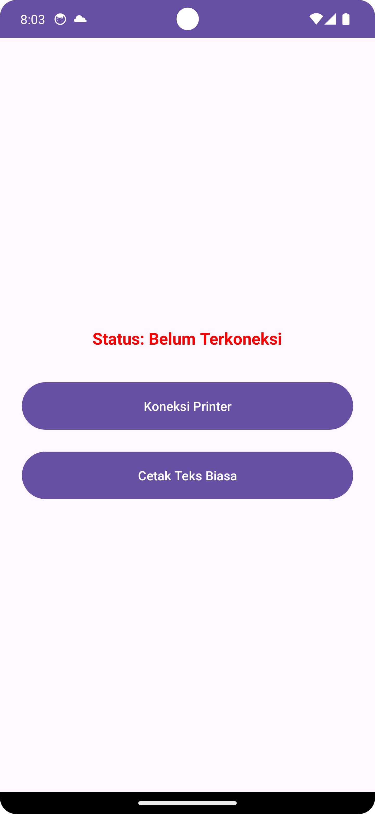
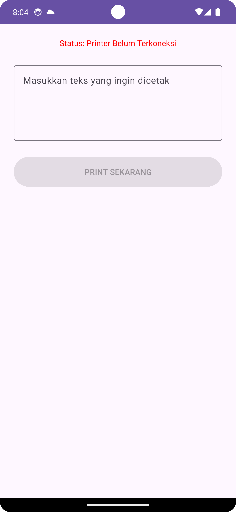

# 🖨️ Tutorial: Membuat Aplikasi Android Thermal Printer (PrintBt)

Panduan langkah demi langkah membangun aplikasi Android untuk mencetak struk/teks ke Printer Thermal Bluetooth menggunakan Java. Project ini sudah mendukung **Android 14 (API 34)** dengan penanganan izin Bluetooth terbaru.

🔗 **Lihat Source Code Lengkap:** [GitHub Repository - PrintBt](https://github.com/theputras/MOBILESI/tree/main/androidProject/printBt)

---

## 🛠️ Persiapan Awal

Sebelum memulai, pastikan kamu memiliki:

1. **Android Studio** (Versi terbaru disarankan).
2. **HP Android Fisik** (Emulator tidak bisa digunakan untuk tes Bluetooth).
3. **Printer Thermal Bluetooth** (Merek apa saja: Panda, EPPOS, VSC, dll).

---

## 🚀 Langkah 1: Setup Project

1. Buat project baru di Android Studio.
2. Pilih **Empty Views Activity**.
3. Language: **Java**.
4. Minimum SDK: **API 24** (atau sesuai kebutuhan).
5. Target SDK: **34** (Android 14).

Struktur folder yang akan kita bangun:

```text
com.theputras.printbt
├── MainActivity.java           // Menu Utama
├── DeviceListActivity.java     // Scan & Pairing
├── PrintTextActivity.java      // Input Teks
└── utils
    └── BluetoothHelper.java    // Logic Koneksi (Otak Aplikasi)
```

## 🛠️ Persiapan Awal

Sebelum memulai, pastikan kamu memiliki:

1. **Android Studio** (Versi terbaru disarankan).
2. **HP Android Fisik** (Emulator tidak bisa digunakan untuk tes Bluetooth).
3. **Printer Thermal Bluetooth** (Merek apa saja: Panda, EPPOS, VSC, dll).

---

## 🚀 Langkah 1: Setup Project

1. Buat project baru di Android Studio.
2. Pilih **Empty Views Activity**.
3. Language: **Java**.
4. Minimum SDK: **API 24** (atau sesuai kebutuhan).
5. Target SDK: **34** (Android 14).

Struktur folder yang akan kita bangun:

```text
com.theputras.printbt
├── MainActivity.java           // Menu Utama
├── DeviceListActivity.java     // Scan & Pairing
├── PrintTextActivity.java      // Input Teks
└── utils
    └── BluetoothHelper.java    // Logic Koneksi (Otak Aplikasi)
```

## ⚙️ Langkah 2: Pengaturan Izin (Manifest)

Karena Android 12 ke atas memperketat izin Bluetooth, kita wajib menambahkan permission khusus di `AndroidManifest.xml`.

**Yang perlu dilakukan:** Tambahkan izin `BLUETOOTH_CONNECT` dan `BLUETOOTH_SCAN` serta daftarkan Activity baru.

👉 [Lihat Kode AndroidManifest.xml di GitHub](https://github.com/theputras/MOBILESI/blob/main/androidProject/printBt/app/src/main/AndroidManifest.xml)

---

📱 Screenshot


|                    Menu Utama                    |                   Cari Printer                   |                   Input & Print                   |
| :-----------------------------------------------: | :-----------------------------------------------: | :-----------------------------------------------: |
|  |  |  |

## 🧠 Langkah 3: Membuat Logic Bluetooth (Backend)

Kita butuh satu class khusus untuk menangani koneksi agar **stabil** dan tidak putus saat pindah layar. Kita menggunakan pola *Singleton*.

**1. Buat Package Utils:** Klik kanan pada package utama -> New -> Package -> beri nama `utils`.

**2. Buat Class BluetoothHelper:** Class ini menangani:

* Membuka socket bluetooth.
* Mengirim data `byte` ke printer.
* Mengatasi masalah *buffer stuck* (teks tidak keluar).

👉 [Lihat Kode BluetoothHelper.java di GitHub](https://github.com/theputras/MOBILESI/blob/main/androidProject/printBt/app/src/main/java/com/theputras/printbt/utils/BluetoothHelper.java)

> **Tips Coding:** Perhatikan bagian `outputStream.flush()` dan `Thread.sleep(300)` di fungsi print. Itu kunci agar printer thermal mencetak dengan lancar tanpa delay.

---

## 📱 Langkah 4: Membuat User Interface (Layout)

Kita membutuhkan 3 tampilan utama. Silakan buat file XML berikut di `res/layout/`.

### A. Menu Utama (Dashboard)

Tampilan sederhana berisi status koneksi dan navigasi ke menu lain.

* File: `activity_main.xml`
* 👉 [Lihat Layout Main](https://github.com/theputras/MOBILESI/blob/main/androidProject/printBt/app/src/main/res/layout/activity_main.xml)

### B. List Perangkat Bluetooth

Tampilan untuk scan device, menampilkan list dalam ListView, dan tombol connect.

* File: `activity_device_list.xml`
* 👉 [Lihat Layout Device List](https://github.com/theputras/MOBILESI/blob/main/androidProject/printBt/app/src/main/res/layout/activity_device_list.xml)

### C. Menu Input & Print

Tampilan input teks (EditText) dan tombol eksekusi print.

* File: `activity_print_text.xml`
* 👉 [Lihat Layout Print Text](https://github.com/theputras/MOBILESI/blob/main/androidProject/printBt/app/src/main/res/layout/activity_print_text.xml)

---

## 🔌 Langkah 5: Menghubungkan UI dengan Logic (Activity)

Sekarang saatnya membuat otak dari setiap tampilan.

**1. DeviceListActivity.java (Scanning & Pairing)** Ini bagian tersulit karena harus meminta izin *Runtime Permission* ke user.

* Fungsi: Scan device, Request Permission, Connect ke device, Simpan status koneksi.
* 👉 [Lihat Kode DeviceListActivity.java](https://github.com/theputras/MOBILESI/blob/main/androidProject/printBt/app/src/main/java/com/theputras/printbt/DeviceListActivity.java)

**2. PrintTextActivity.java (Eksekusi Print)** Mengambil teks dari inputan user dan mengirimnya ke `BluetoothHelper`.

* 👉 [Lihat Kode PrintTextActivity.java](https://github.com/theputras/MOBILESI/blob/main/androidProject/printBt/app/src/main/java/com/theputras/printbt/PrintTextActivity.java)

**3. MainActivity.java (Navigasi)** Hanya jembatan antar menu dan monitor status koneksi.

* 👉 [Lihat Kode MainActivity.java](https://github.com/theputras/MOBILESI/blob/main/androidProject/printBt/app/src/main/java/com/theputras/printbt/MainActivity.java)

---

## ✅ Langkah 6: Testing & Troubleshooting

### Cara Menjalankan:

1. Build project ke HP Android fisik.
2. Nyalakan Bluetooth & Printer Thermal.
3. Buka App -> **Koneksi Printer**.
4. Pilih printer dari list -> Tunggu sampai Toast "Berhasil Terkoneksi".
5. Masuk ke menu **Cetak Teks** dan coba print.

### Masalah Umum & Solusi:

**Kasus 1: Aplikasi Crash saat klik Scan**

* *Penyebab:* Permission belum diizinkan di settingan HP.
* *Solusi:* Pastikan kode `ActivityCompat.requestPermissions` di `DeviceListActivity` sudah benar.

**Kasus 2: Status Konek, tapi Printer diam saat di-Print**

* *Penyebab:* Data nyangkut di buffer (selang) bluetooth.
* *Solusi:* Pastikan di `BluetoothHelper.java` kamu sudah menambahkan perintah enter (`\n\n\n`) dan `flush()` di akhir pengiriman data.

**Kasus 3: Error `socket closed` atau `timeout`**

* *Penyebab:* Kamu mencoba konek ke HP lain/Laptop, bukan Printer Thermal.
* *Solusi:* Pastikan target device adalah Printer yang mendukung protokol SPP (Serial Port Profile).

---

*Dibuat oleh **The Putra's**.*
